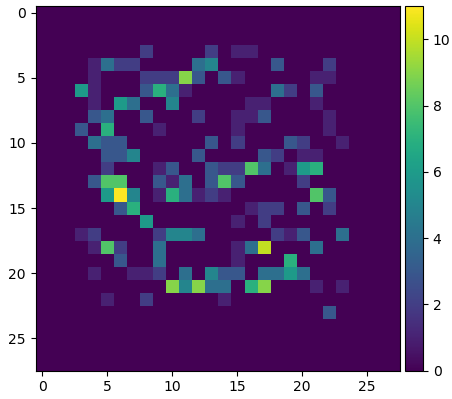

# TensorFlow implementation of Deformable Convolution

This is a TensorFlow implementation of the following paper:
> Dai, Jifeng, Haozhi Qi, Yuwen Xiong, Yi Li, Guodong Zhang, Han Hu, and Yichen Wei. 2017.
> Deformable Convolutional Networks.  arXiv [cs.CV]. arXiv. http://arxiv.org/abs/1703.06211

The code can only run in the [Eager Execution](https://www.tensorflow.org/guide/eager).

Rotated training image  


Sampling locations  


## Basic Usage

`DeformableConvLayer` is a custom Keras layer, so you can use it like any other standard layer, such as `Dense`, `Conv2D`.

This is a simple example:
```python
inputs = tf.zeros([16, 28, 28, 3])

model = tf.keras.Sequential()
model.add(DeformableConvLayer(filters=6, kernel_size=3, strides=1, padding='valid', dilation_rate=1, num_deformable_group=1))
model.add(Conv2D(6, 3))
outputs = model(inputs)
```
